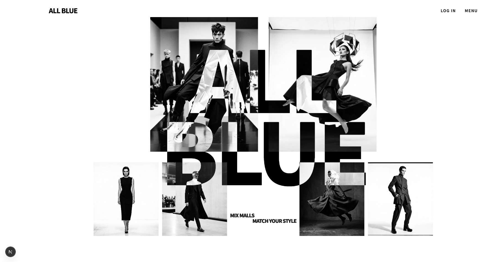
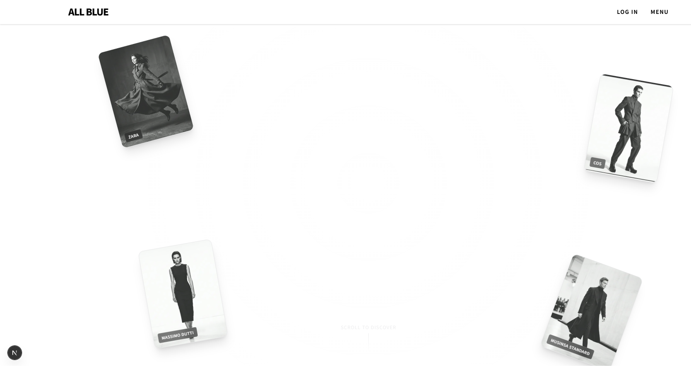
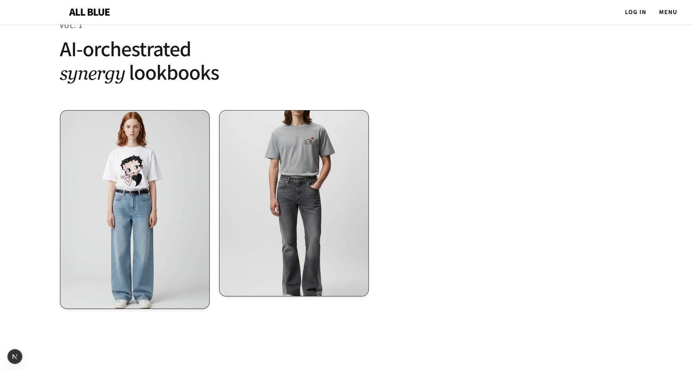
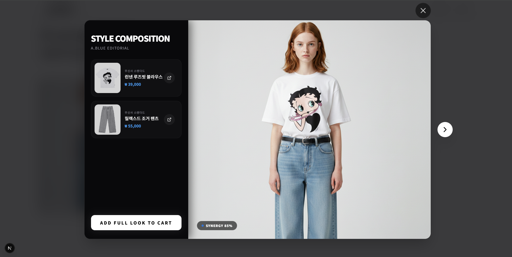
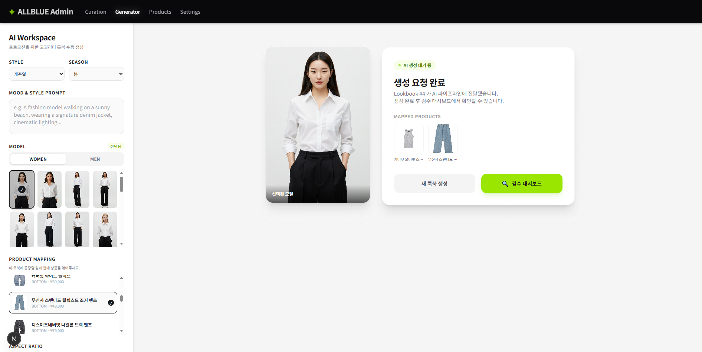
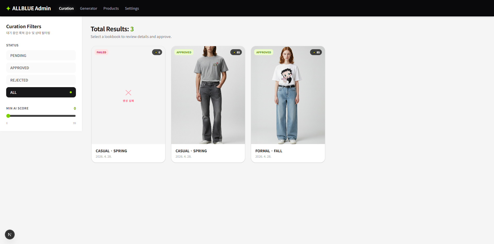
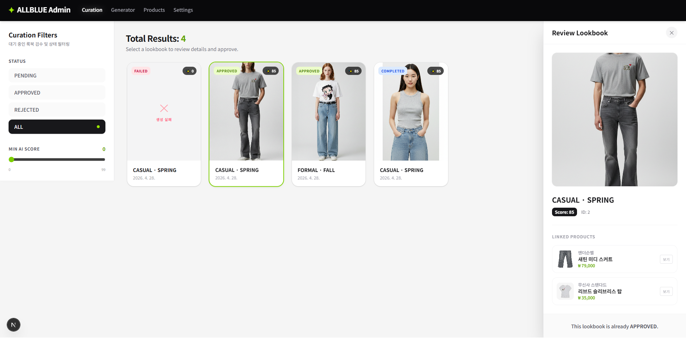
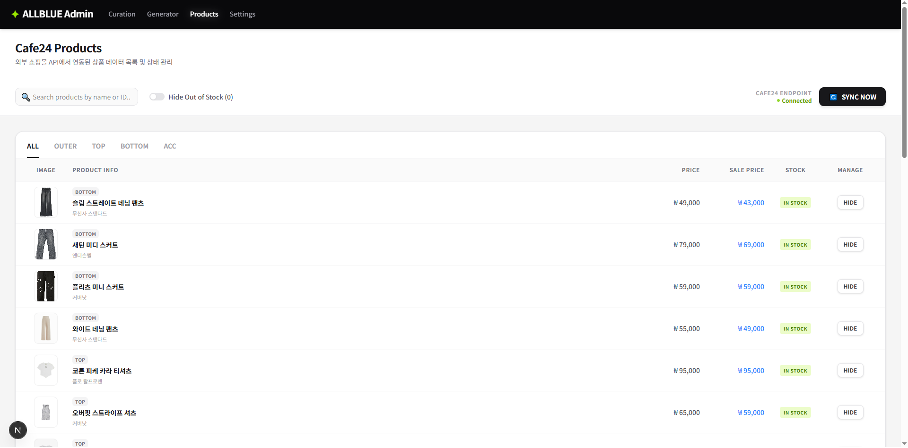

# ALLBLUE Frontend

> **ALL BLUE** — AI가 생성한 크로스-셀러 룩북 플랫폼의 프론트엔드

---

## 프로젝트 소개

ALLBLUE는 여러 브랜드(Cafe24 입점 셀러)의 상품을 AI로 조합해 룩북을 생성하고,  
사용자가 코디를 탐색하고 전체 룩을 한 번에 구매할 수 있는 패션 플랫폼입니다.

본 레포는 사용자향 서비스(랜딩, 갤러리)와 어드민(Generator, Curation, Products) 기능을 포함한 Next.js 프론트엔드입니다.

---

## ALLBLUE-FE 포지션

ALLBLUE-FE는 새 기획을 바탕으로 전 영역을 신규 구현하였으며, 아래 화면 전체가 1인 작업 결과물입니다.

---

## 주요 화면

| 랜딩 — Hero | 랜딩 — 브랜드 탐색 |
|:---:|:---:|
|  |  |

| 랜딩 — AI 룩북 소개 | 갤러리 Quick View |
|:---:|:---:|
|  |  |

| Admin — Generator | Admin — Curation 목록 |
|:---:|:---:|
|  |  |

| Admin — Curation 상세 검수 | Admin — Products |
|:---:|:---:|
|  |  |

---

## 기술 스택

| 분류 | 사용 기술 |
|------|-----------|
| Framework | Next.js 16 (App Router), React 19, TypeScript |
| Styling | Tailwind CSS v4, shadcn/ui, Radix UI, Framer Motion |
| 상태관리 | Zustand |
| 인증 | NextAuth.js |
| API 통신 | axios |

---

## 1인 구현 영역

### ✅ 신규 구현

- **랜딩 페이지** — Hero 섹션, 브랜드 카드 플로팅 애니메이션, AI 룩북 소개 섹션
- **갤러리 & Quick View** — 룩북 카드 목록, Style Composition 모달 (AI Synergy Score 표시, 전체 룩 장바구니 담기)
- **Admin — Generator** — AI Workspace (스타일·시즌·프롬프트 입력, 모델 선택, 상품 매핑, 생성 결과 확인)
- **Admin — Curation** — 룩북 검수 목록 (PENDING / APPROVED / REJECTED 필터, Min AI Score 슬라이더), 상세 승인·반려 처리
- **Admin — Products** — Cafe24 API 연동 상품 목록, 카테고리 탭(OUTER / TOP / BOTTOM / ACC), SYNC 기능

---

## 시작하기

```bash
npm install
npm run dev
```

---

## 관련 레포
| [A.BLUE-BE](https://github.com/A-BLUE-PROJECT/A.BLUE-BE) | Spring Boot 백엔드 |
| [Mirror Agent](https://github.com/woongblack/mirror-agent) | 자체 검토 도구 |